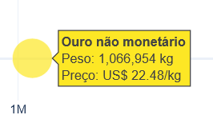
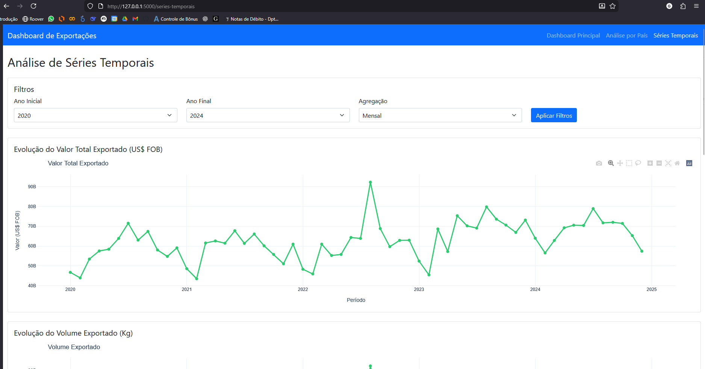
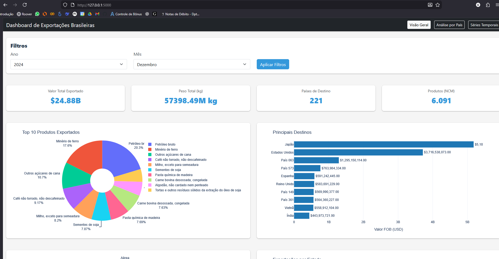
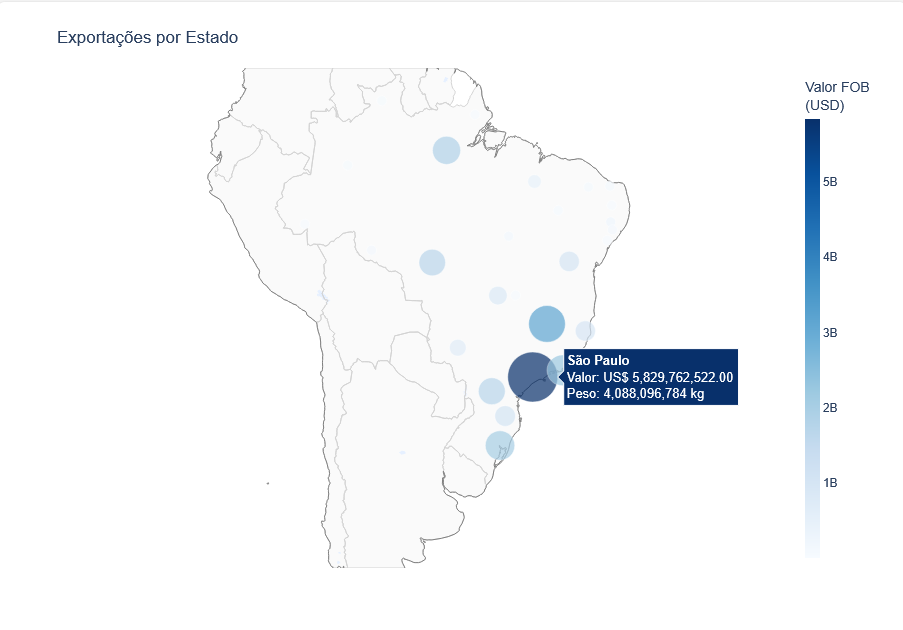
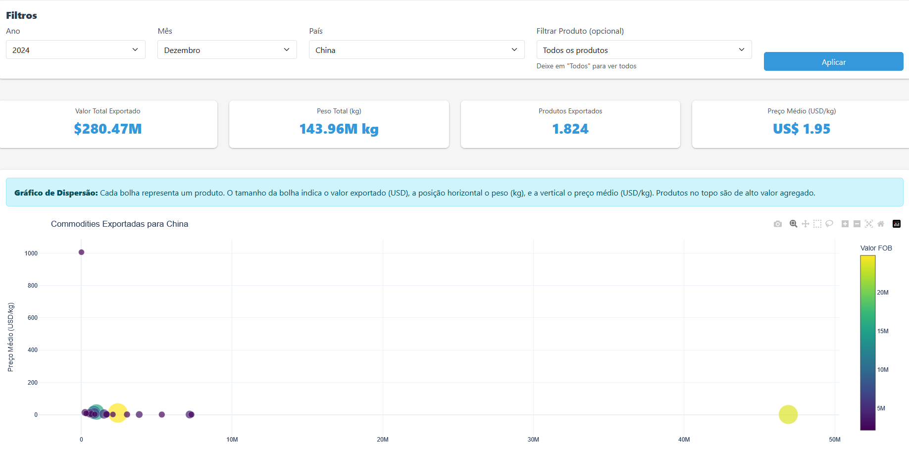

# Brazilian Exports Analysis

Dashboard de análise de exportações brasileiras usando dados públicos do ComexStat (MDIC).

## Descrição

Sistema web para visualização e análise de dados de exportação do Brasil. Permite análise por produto (NCM), país de destino, modal de transporte e estado de origem, utilizando dados reais do Ministério da Economia (2020-2024).

## Capturas de Tela

### Dashboard Principal
Interface principal com visão geral das exportações brasileiras.



### Análise por País
Seleção de país específico com filtros por ano e mês.



### Visualização de Dados
Gráfico de bolhas mostrando volume e valor das exportações por produto.



### Séries Temporais
Análise de evolução temporal das exportações entre 2020 e 2024.



### Distribuição Geográfica
Mapa interativo do Brasil com distribuição de exportações por estado.



## Funcionalidades

- Dashboard interativo com gráficos dinâmicos
- Filtros por ano, mês, país e produto específico
- KPIs principais (valor total, peso, países, produtos)
- Visualizações por:
  - Top produtos exportados (9.301 NCMs traduzidos)
  - Principais destinos
  - Modal de transporte
  - Distribuição por estado (mapa do Brasil)
  - Análise por país com gráfico de bolhas
  - Séries temporais multi-anuais
- API REST para integração
- Dados reais: 5 anos (2020-2024), 475 MB de exportações

## Tecnologias

- Python 3.11+
- Flask 3.0.0 (backend web)
- Plotly 5.18.0 (visualizações interativas)
- Pandas 2.1.4 (processamento de dados)
- Bootstrap 5 (interface responsiva)
- ComexStat API (dados governamentais)

## Instalação

### Opção 1: Docker (Recomendado)

**Requisitos:**
- Docker
- Docker Compose

**Passos:**

1. Clone o repositório:
```bash
git clone https://github.com/GSMuller/brazilian-exports-analysis.git
cd brazilian-exports-analysis
```

2. Inicie a aplicação:
```bash
docker-compose up -d
```

3. Acesse no navegador:
```
http://localhost:5000
```

**Comandos úteis:**
```bash
# Ver logs
docker-compose logs -f

# Parar aplicação
docker-compose down

# Reconstruir imagem
docker-compose up -d --build
```

### Opção 2: Instalação Manual

**Requisitos:**
- Python 3.11 ou superior
- pip

**Passos:**

1. Clone o repositório:
```bash
git clone https://github.com/GSMuller/brazilian-exports-analysis.git
cd brazilian-exports-analysis
```

2. Crie um ambiente virtual:
```bash
python -m venv venv
```

3. Ative o ambiente virtual:

Windows:
```bash
venv\Scripts\activate
```

Linux/Mac:
```bash
source venv/bin/activate
```

4. Instale as dependências:
```bash
pip install -r requirements.txt
```

5. Descomprima os datasets:
```bash
python scripts/descomprimir_datasets.py
```

6. Execute a aplicação:
```bash
python app.py
```

7. Acesse no navegador:
```
http://localhost:5000
```

## Estrutura do Projeto

```
brazilian-exports-analysis/
├── app.py                  # Aplicação Flask principal
├── config.py               # Configurações
├── requirements.txt        # Dependências Python
├── .env.example           # Exemplo de variáveis de ambiente
## Estrutura do Projeto

```
brazilian-exports-analysis/
├── app.py                     # Aplicação Flask principal
├── config.py                  # Configurações
├── requirements.txt           # Dependências Python
├── Dockerfile                 # Imagem Docker
├── docker-compose.yml         # Orquestração Docker
├── .dockerignore             # Arquivos excluídos do build
├── .gitignore                # Arquivos excluídos do Git
├── run.bat                   # Script Windows para iniciar servidor
├── scripts/                  # Scripts utilitários
│   ├── download_data.py      # Baixa dados reais do ComexStat
│   ├── descomprimir_datasets.py  # Extrai CSVs dos ZIPs
│   ├── extrair_ncms.py       # Extrai NCMs únicos dos dados
│   ├── gerar_ncm_sh6.py      # Gera dicionário de 9.301 NCMs
│   ├── gerar_dicionario_ncm.py  # Versão antiga do gerador
│   ├── test_server.py        # Testes do servidor
│   └── data/                # Arquivos temporários
├── docs/                     # Documentação
│   └── INSTALL.md           # Guia de instalação detalhado
├── datasets/                 # Dados de exportação
│   ├── EXP_2020.zip          # 2020 (19 MB)
│   ├── EXP_2021.zip          # 2021 (21 MB)
│   ├── EXP_2022.zip          # 2022 (22 MB)
│   ├── EXP_2023.zip          # 2023 (22 MB)
│   └── EXP_2024.zip          # 2024 (23 MB)
├── services/                 # Serviços da aplicação
│   ├── api_service.py        # Integração com ComexStat
│   ├── data_processor.py     # Processamento de dados
│   ├── visualization.py      # Geração de gráficos Plotly
│   ├── codigos_comexstat.py  # Mapeamentos (países, NCMs, modais)
│   └── ncm_completo.py       # Dicionário auto-gerado de 9.301 NCMs
├── templates/                # Templates HTML
│   ├── index.html            # Dashboard principal
│   ├── analise_pais.html     # Análise por país
│   └── series_temporais.html # Séries temporais
├── static/                   # Arquivos estáticos
│   ├── css/
│   │   └── style.css
│   └── js/
│       ├── dashboard.js
│       ├── analise_pais.js
│       └── series_temporais.js
└── README.md
```

## Uso

### Dashboard Web

Acesse `http://localhost:5000` para visualizar o dashboard principal com três páginas:

1. **Dashboard**: Visão geral com KPIs e gráficos (top produtos, países, modais, estados)
2. **Análise por País**: Filtro por país específico + produto, gráfico de bolhas
3. **Séries Temporais**: Análise multi-anual com evolução mensal

Use os filtros de ano, mês, país e produto para selecionar o período desejado.

### API Endpoints

#### GET /api/dashboard-data
Retorna dados agregados para o dashboard.

Parâmetros:
- `year` (opcional): Ano (padrão: 2024)
- `month` (opcional): Mês (padrão: 12)

#### GET /api/paises
Retorna lista de países disponíveis para filtro.

Parâmetros:
- `year`: Ano
- `month`: Mês

#### GET /api/produtos-pais
Retorna lista de produtos exportados para um país específico.

Parâmetros:
- `year`: Ano
- `month`: Mês
- `pais`: Nome do país

#### GET /api/analise-pais-data
Retorna dados agregados para análise por país.

Parâmetros:
- `year`: Ano
- `month`: Mês
- `pais`: Nome do país
- `produto` (opcional): Filtro por produto específico

#### GET /api/series-temporais
Retorna série temporal para análise multi-anual.

Parâmetros:
- `ano_inicio`: Ano inicial (2020-2024)
- `ano_fim`: Ano final (2020-2024)
- `agregacao`: Tipo de agregação (ncm, pais, modal)
- `top_n`: Número de itens no ranking (padrão: 10)

## Fonte de Dados

Os dados são obtidos do **ComexStat**, sistema de estatísticas de comércio exterior do Ministério da Economia.

- **Dados reais**: 2020-2024 (5 anos)
- **Volume total**: 475 MB descomprimido, 107 MB comprimido
- **Formato**: CSV com separador `;`, encoding `latin1`
- **NCMs traduzidos**: 9.301 produtos mapeados com tabela SH6 do governo
- **Atualização**: Anual (EXP_YYYY.csv)

Site oficial: https://balanca.economia.gov.br/balanca/bd/comexstat-bd/ncm/

## Desenvolvimento

### Estrutura de Serviços

- **api_service.py**: Carrega CSVs anuais, filtra por mês, traduz NCMs
- **data_processor.py**: Agregações por NCM, país, modal, estado
- **visualization.py**: Gera gráficos Plotly (pie, bar, bubble, line, map)
- **codigos_comexstat.py**: Mapeamentos estáticos (60 NCMs manuais, 40 países, 10 modais)
- **ncm_completo.py**: Dicionário auto-gerado com 9.301 NCMs

### Adicionando Novas Visualizações

1. Adicione o método no `services/visualization.py`
2. Processe os dados no `services/data_processor.py`
3. Adicione a rota em `app.py`
4. Atualize o frontend em `templates/*.html` e `static/js/*.js`

### Atualizando Dados

Para baixar dados mais recentes do ComexStat:

```bash
# Baixa CSVs anuais mais recentes
python scripts/download_data.py

# Comprime para Git (se necessário)
# Use 7zip, WinRAR ou zip -9 datasets/EXP_YYYY.csv
```

### Regenerando Dicionário NCM

Se houver novos NCMs nos dados:

```bash
# Extrai NCMs únicos dos CSVs
python scripts/extrair_ncms.py

# Gera ncm_completo.py com tabela SH6 do governo
python scripts/gerar_ncm_sh6.py
```

## Deploy em Produção

### Docker em Servidor

```bash
# Clone no servidor
git clone https://github.com/GSMuller/brazilian-exports-analysis.git
cd brazilian-exports-analysis

# Build e start
docker-compose up -d

# Logs
docker-compose logs -f
```

### Recomendações de Produção

1. **Reverse Proxy**: Use nginx na frente do Flask
2. **WSGI Server**: Configure gunicorn ou uwsgi (substituir `python app.py`)
3. **SSL**: Configure certificado HTTPS
4. **Cache**: Implemente Redis para queries frequentes
5. **Database**: Migre dados processados para PostgreSQL
6. **Monitoring**: Configure logs e métricas (Prometheus, Grafana)

### Exemplo nginx.conf

```nginx
server {
    listen 80;
    server_name seu-dominio.com;

    location / {
        proxy_pass http://localhost:5000;
        proxy_set_header Host $host;
        proxy_set_header X-Real-IP $remote_addr;
    }
}
```

## Licença

Este projeto está sob a licença MIT.

## Contato

Desenvolvido para análise profissional de dados de exportação brasileira.

Para dúvidas ou sugestões, abra uma issue no GitHub.

---

**Dados**: ComexStat (Ministério da Economia)  
**Período**: 2020-2024  
**NCMs traduzidos**: 9.301 produtos  
**Última atualização**: 2024

